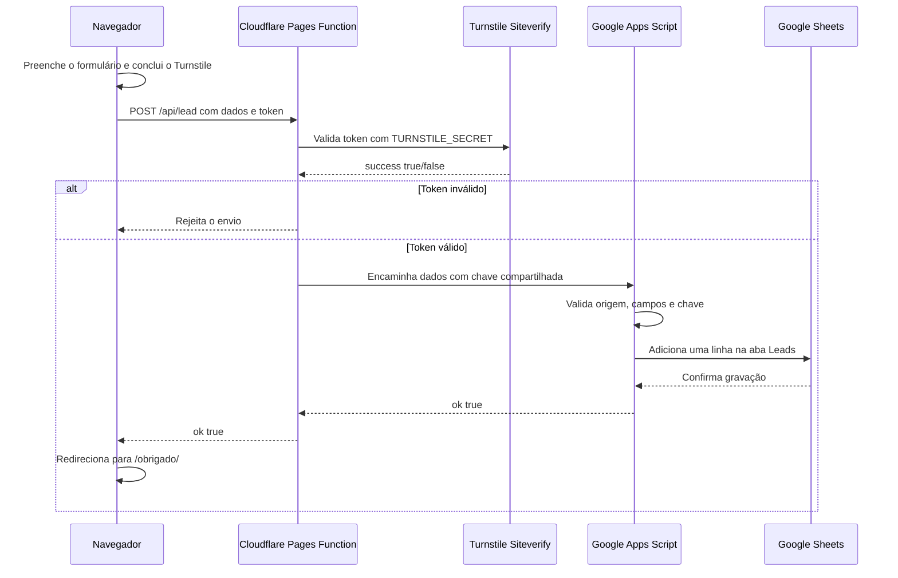

# Site Luiz Reis

Site estático em Astro, publicado no Cloudflare Pages em `luizzcreeiss.com.br`.

## Comandos

```sh
npm install
npm run dev
npm run build
```

## Como o formulário, Turnstile e Apps Script trabalham juntos

O Turnstile não grava nada na planilha. Ele apenas entrega ao navegador um token temporário que comprova que o envio passou pela verificação contra bots. Quem valida esse token e controla o fluxo é a Pages Function em [`functions/api/lead.js`](./functions/api/lead.js).



### Fluxo detalhado

1. [`src/components/LeadForm.astro`](./src/components/LeadForm.astro) renderiza o widget usando `PUBLIC_TURNSTILE_SITE_KEY`. Essa chave é pública por definição.
2. Depois da verificação, o Turnstile cria automaticamente o campo `cf-turnstile-response` com um token de uso único e curta duração.
3. [`src/scripts/forms.ts`](./src/scripts/forms.ts) envia os dados e esse token para `POST /api/lead`, no próprio domínio. O navegador não chama mais o Apps Script diretamente.
4. A Pages Function valida origem, tamanho, nome, telefone, e-mail e identificador da requisição.
5. A Function chama o endpoint oficial `siteverify` da Cloudflare usando `TURNSTILE_SECRET`. O lead só continua quando a resposta contém `success: true`, hostname e action compatíveis.
6. Depois da aprovação, a Function chama o Apps Script usando `APPS_SCRIPT_URL` e envia `APPS_SCRIPT_SHARED_SECRET` junto com os dados.
7. [`google-apps-script/Code.gs`](./google-apps-script/Code.gs) confere a chave compartilhada, repete as validações, neutraliza fórmulas perigosas e grava o lead na planilha.
8. Somente após a confirmação do Google, o site redireciona para `/obrigado/`.

Essa separação impede que a URL do Apps Script e as chaves secretas sejam incorporadas ao JavaScript público do site.

## Variáveis e onde ficam

| Nome | Local | É secreta? | Finalidade |
|---|---|---:|---|
| `PUBLIC_TURNSTILE_SITE_KEY` | Cloudflare Pages | Não | Renderizar o widget no navegador durante o build |
| `TURNSTILE_SECRET` | Cloudflare Pages | Sim | Validar o token no Siteverify dentro da Pages Function |
| `APPS_SCRIPT_URL` | Cloudflare Pages | Sim | Endereço `/exec` chamado somente pela Function |
| `APPS_SCRIPT_SHARED_SECRET` | Cloudflare Pages e propriedades do Apps Script | Sim | Autorizar a comunicação entre Cloudflare e Google |
| `SPREADSHEET_ID` | Propriedades do Apps Script | Sim | Identificar a planilha de destino |

As três variáveis secretas da Cloudflare devem ser cadastradas como **Secret/Encrypted**. Nunca use prefixo `PUBLIC_` nelas e nunca as envie para o Git.

`PUBLIC_APPS_SCRIPT_URL` pertence ao fluxo antigo e não deve mais existir no Cloudflare Pages.

## Camadas de proteção

- O honeypot descarta robôs simples sem gravar na planilha.
- O Turnstile bloqueia envios automatizados antes do Apps Script.
- A Pages Function rejeita requisições de outra origem e payloads acima do limite.
- Tokens do Turnstile são validados somente no servidor, nunca no navegador.
- A chave compartilhada impede gravações diretas no Apps Script.
- O Apps Script valida novamente todos os campos.
- Valores iniciados por `=`, `+`, `-` ou `@` são neutralizados antes de entrar no Sheets.
- `LockService` evita conflito entre gravações simultâneas.
- A URL do Apps Script e os segredos não aparecem no build público.

## Configuração e publicação

O procedimento completo para configurar planilha, propriedades do Apps Script, widget Turnstile e variáveis do Cloudflare está em [`google-apps-script/README.md`](./google-apps-script/README.md).

Ao alterar `PUBLIC_TURNSTILE_SITE_KEY`, é obrigatório iniciar um novo deploy porque ela é incorporada durante o build do Astro.

Ao alterar `Code.gs`, crie uma nova versão em **Implantar > Gerenciar implantações > Editar > Nova versão**. Salvar o arquivo no editor não atualiza automaticamente o aplicativo `/exec`.

## Desenvolvimento local

`npm run dev` executa o frontend Astro, mas não executa a Pages Function. O arquivo `.env.development` contém somente a Site Key oficial de teste para renderizar o widget localmente.

Para testar o fluxo completo:

1. Copie `.dev.vars.example` para `.dev.vars`.
2. Preencha `APPS_SCRIPT_URL` e `APPS_SCRIPT_SHARED_SECRET` em `.dev.vars`.
3. Gere o build com a Site Key de teste:

```sh
PUBLIC_TURNSTILE_SITE_KEY=1x00000000000000000000AA npm run build
```

4. Execute o ambiente local do Pages:

```sh
npx wrangler pages dev dist
```

As chaves de teste nunca devem ser usadas no deploy de produção.

## Diagnóstico rápido

| Sintoma | Verificação |
|---|---|
| Widget não aparece | Confira `PUBLIC_TURNSTILE_SITE_KEY` em Production e faça novo deploy |
| “Verificação expirou ou não foi aceita” | Confira os hostnames do widget e se `TURNSTILE_SECRET` corresponde à Site Key |
| `/api/lead` retorna `503` | Alguma variável da Pages Function não foi cadastrada no ambiente correto |
| `/api/lead` retorna `502` | Confira a URL `/exec`, a nova implantação e a chave compartilhada |
| Envio funciona, mas não aparece na planilha | Confira `SPREADSHEET_ID`, permissões da conta Google e execuções do Apps Script |
| Alteração no Apps Script não surtiu efeito | Publique uma nova versão da implantação |

Para investigar produção, consulte os logs da Pages Function no Cloudflare e a página **Execuções** do Google Apps Script. Não registre dados pessoais ou segredos nos logs.
